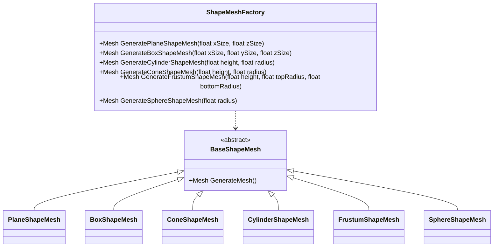

# ShapeMesh
常见图形Mesh的生成



* 平面图形Mesh生成

```c#
var mesh = ShapeMeshFactory.GeneratePlaneShapeMesh(5, 5, meshPivot: meshPivot);
```

* 立方体图形Mesh生成

```c#
var mesh = ShapeMeshFactory.GenerateBoxShapeMesh(2, 2, 2, meshPivot: meshPivot);
```

* 圆锥体图形Mesh生成

```C#
var mesh = ShapeMeshFactory.GenerateConeShapeMesh(5, 2, meshPivot: meshPivot);
```

* 圆柱体图形Mesh生成

```C#
var mesh = ShapeMeshFactory.GenerateCylinderShapeMesh(5, 2, meshPivot: meshPivot);
```

* 圆锥台图形Mesh生成

```c#
var mesh = ShapeMeshFactory.GenerateFrustumShapeMesh(5, 2, 3, meshPivot: meshPivot);
```

* 球图形Mesh生成

```c#
var mesh = ShapeMeshFactory.GenerateSphereShapeMesh(5, meshPivot: meshPivot);
```

